# vehicle-demo-using-blockchain-starter-plan

In this pattern, see how to create a network on the [IBM Blockchain Platform](https://www.ibm.com/blockchain/platform), install a smart contract (chaincode) onto a peer in the network, and run a sample application to invoke it. You'll see how to populate the shared ledger and communicate with it by making calls from a local client application to query and update the ledger.


The [IBM Blockchain Platform Starter Plan](https://www.ibm.com/blogs/blockchain/2018/03/getting-started-on-the-ibm-blockchain-platform-starter-plan/) is a fully integrated and enterprise-ready service running on the [IBM Cloud](www.ibm.com/cloud/). The platform is designed to accelerate the development, governance, and operation of a multi-institution business network. Starter Plan is specifically aimed at test and development scenarios rather than production ones. For production scenarios you should use the Enterprise Plan.
The sample application we'll use in this pattern is a Hyperledger Fabric sample called *fabcar* and, while you can review the sample and run it locally in a Docker container; in this pattern you'll see how to install and run it on the IBM Blockchain Platform Starter Plan on the IBM Cloud. Hyperledger is a global, open source, collaborative effort, hosted by The Linux Foundation, to advance cross-industry blockchain technologies. Hyperledger Fabric is a Hyperledger project and framework implementation whose modular architecture powers the IBM Blockchain Platform Starter Plan.


This code pattern is for developers looking to start building blockchain applications using the IBM Blockchain Platform Starter Plan. When the reader has completed this code pattern, they will understand how to:
* Create a network on the IBM Blockchain Platform
* Install a smart contract (chaincode) onto a peer in the network
* Run a sample application to query and update the ledger


## Architecture Flow


1. The buyer of the vehicle views the catalog of cars on his dashboard.
2. They personalize the vehicle by selecting model, exterior and interior options and other packages/add-ons available withthe vehicle.
3. They submit the order.
4. The order is received by the manufacturer on their dashboard where they view the progress of the assembly of the vehicle and the shipment status.
5. The vehicle regulatory views and tracks all details and changes with respect to the order on the blockchain, allowing maximum transparency.

## Included Components
* [Hyperledger Composer v0.20.3](https://hyperledger.github.io/composer/latest/) Hyperledger Composer is an extensive, open development toolset and framework to make developing blockchain applications easier
* [Hyperledger Fabric v1.3](https://hyperledger-fabric.readthedocs.io/en/release-1.3/) Hyperledger Fabric is a platform for distributed ledger solutions, underpinned by a modular architecture delivering high degrees of confidentiality, resiliency, flexibility and scalability.
* [IBM Blockchain Starter Plan](https://console.bluemix.net/catalog/services/blockchain) The IBM Blockchain Platform Starter Plan allows to build and try out blockchain network in an environment designed for development and testing

## Featured Technologies
* [IBM Blockchain](https://www.ibm.com/blockchain): Blockchain is a shared, immutable ledger for recording the history of transactions.
* [Cloud](https://developer.ibm.com/depmodels/cloud/): Accessing computer and information technology resources through the Internet.

## Prerequisites
* NPM V5.6.0
* Node.js V8.10.0
* If you do not have an IBM Cloud account yet, you will need to create one [here](https://idaas.iam.ibm.com/idaas/mtfim/sps/authsvc?PolicyId=urn:ibm:security:authentication:asf:basicldapuser).

## Steps
1. [Setup your machine](#1-setup-your-machine)
2. [Clone the repository](#2-clone-the-repository)
3. [Create a network on the IBM Blockchain Platform Starter Plan](#3-Create-a-network-on-the-IBM-Blockchain-Platform-Starter-Plan)
4. [Install chaincode on the channel](#4-Install-chaincode-on-the-channel)
5. [Configure your application to run on the IBM Blockchain Platform](#5-Configure-your-application-to-run-on-the-IBM-Blockchain-Platform)
6. [Summary](#6-summary)

### 1. Setup your machine
- [npm](https://www.npmjs.com/)  (v5.x)
- [Node](https://nodejs.org/en/) (version 8.9 or higher - note version 9 is not supported)
* to install specific Node version you can use [nvm](https://hyperledger.github.io/composer/latest/installing/installing-prereqs.html)

  Example:
  + 1. `nvm install --lts`
  + 2. `nvm use --lts`
  + 3. Output `Now using node v8.11.3 (npm v5.6.0)`
- [Hyperledger Composer](https://hyperledger.github.io/composer/installing/development-tools.html)
  * to install composer cli
    `npm install -g composer-cli@0.20.3`
- [Cloud Wallet Package](https://www.npmjs.com/package/composer-wallet-cloudant)
  * `npm install -g composer-wallet-cloudant@0.0.13`
- [Cloud Foundry CLI](https://docs.cloudfoundry.org/cf-cli/install-go-cli.html)
  * for Mac OS X Installation
    ```
    brew tap cloudfoundry/tap
    brew install cf-cli
    ```
  * for Linux (Debian and Ubuntu based) Installation
    ```
    wget -q -O - https://packages.cloudfoundry.org/debian/cli.cloudfoundry.org.key | sudo apt-key add -
    echo "deb https://packages.cloudfoundry.org/debian stable main" | sudo tee /etc/apt/sources.list.d/cloudfoundry-cli.list
    sudo apt-get update
    sudo apt-get install cf-cli
    ```

### 2. Clone the repository

```
git clone https://github.com/IBM-Blockchain/vehicle-demo-using-blockchain-starter-plan
```

Go ahead and cd into the directory

```
cd vehicle-demo-using-blockchain-starter-plan
```

### 3. Create a network on the IBM Blockchain Platform Starter Plan
To complete this pattern, you need an IBM Cloud account.  Please note that the Platform is updated often, and the screen shots in this tutorial may not exactly match the ones you see.

=======

Starting on the [Rapidly build with IBM Blockchain Platform](https://console.bluemix.net/catalog/services/blockchain) page, make sure you are logged-in and choose `Dallas` as the region as at the time of writing Starter Plan is only deployed to that region. Enter `Blockchain-demo` as the Service name, then select `Starter Plan Membership` and click `Create`. 

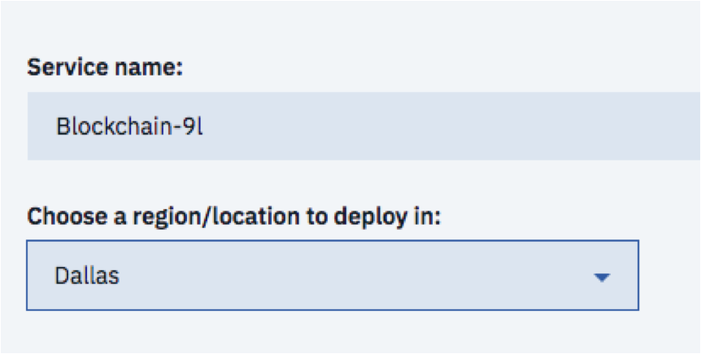

You can now see the **Network created! screen**. Click **Launch** from this screen to see the dashboard for your network.


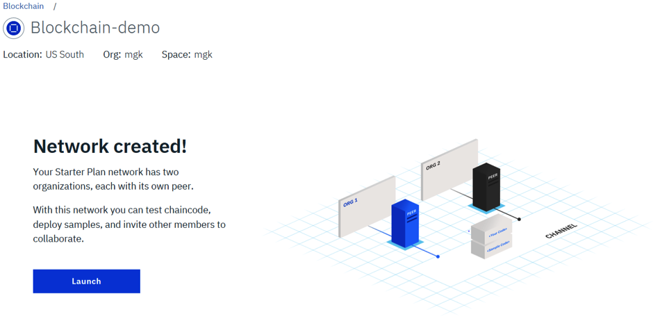

The next screen is the getting started **welcome screen**. Click `Got it` when you have finished reading.

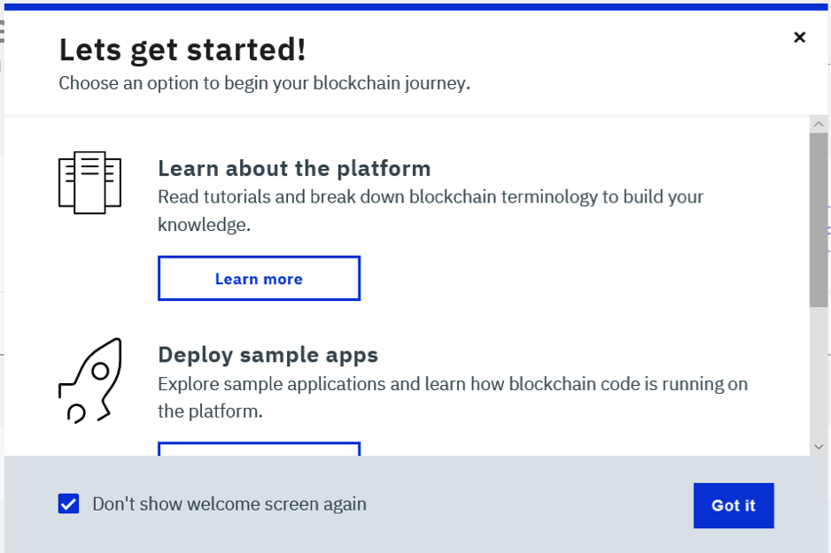

If you look at the top left you will see that your network has been given a generated name. Click on the name and change it to **fabcar**.


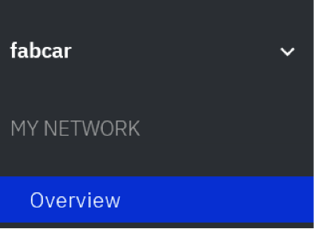

Once you have changed the name you will get a pop-up in the top right for a few seconds informing you that the change has been successful:

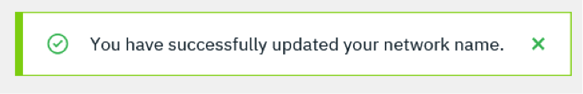

Out of the box, Starter Plan creates you a working simple network. If you select the `Overview` tab you can see an overview of what was created for you automatically:

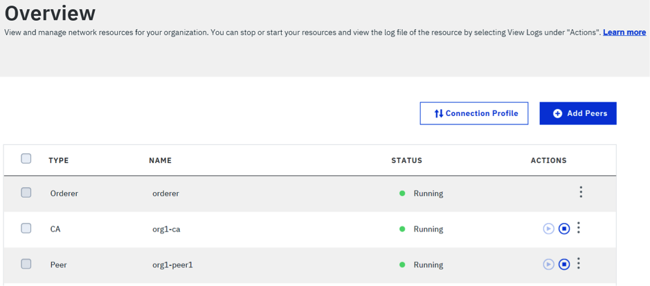


The network actually consists of two organizations **Company A (Org1)** and **Company B (Org2)**, although you are logged on as **Org1** by default and so can only see the `Orderer` service which is shared between both orgs, and a Certificate Authority (CA) and a Peer for **org1**.

If you select the `Members` tab on the left you can see these members in a little more detail:

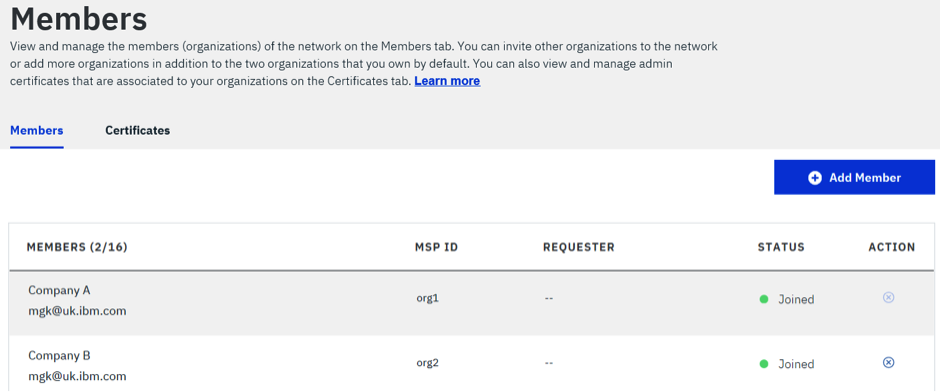

If you select the `Channels` tab on the side you will see that there is also a channel called `defaultchannel` that has been created as well:

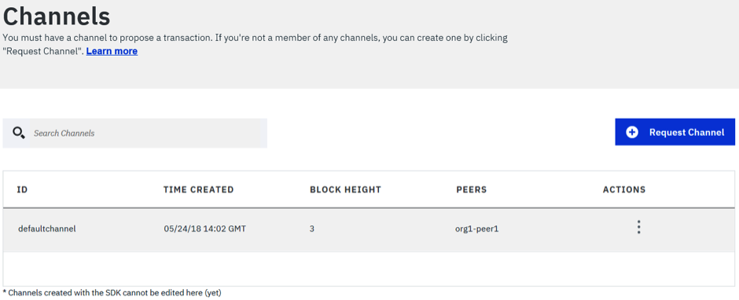

For this pattern we will use this **defaultchannel** for simplicity. Click on the `defaultchannel` row in the table to see more details on the channel:

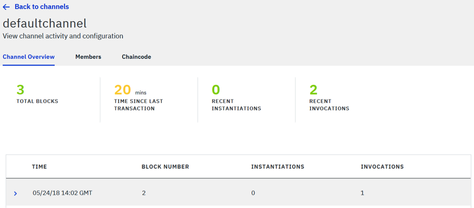

Here you can see that there are already 3 blocks on the chain held by the channel that store the initial configuration information. You can select each row to see more details if you wish.

### 4. Install chaincode on the channel

The next step in this tutorial is to deploy the chaincode to the channel and first we have to get the code to install from a github repository using git clone.

In order to complete this next step you will need to have `git` installed on your local machine. Open a command-line or terminal window, navigate to a suitable directory and create a new directory called `fabcar`. Navigate to the new `fabcar` directory and run the following command to clone the fabric samples source:

`git clone https://github.com/hyperledger/fabric-samples.git`

This will copy the code for all the samples to your local machine. Now we have the code we need to deploy it. Using the Starter Plan UI, select the `Install Code` tab from the left hand sidebar to see the `Install code` screen:

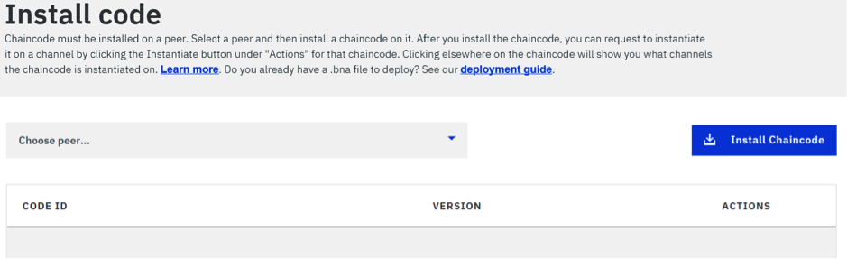

Click the drop-down called `Choose-peer` and select `org1-peer1`. Now click the `Install Chaincode` button.

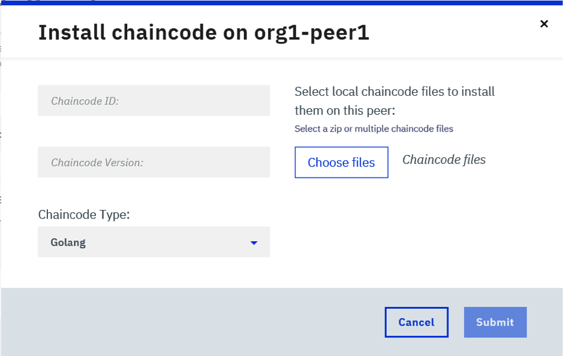

On the `Install chaincode on org1peer1` dialog, enter **fabcar** for the `Chaincode ID`, enter **v1** for the `Chaincode Version`.

You have a choice to deploy either the Nodejs or Golang version of the `fabcar` chaincode. Both provide the same functionality, so the choice comes down in part to skills. Choose `Node` or `Golang` for the `Chaincode Type`.

Finally, on this screen click `Choose files` to select the chaincode source to install.

If you want to use the go version, select the `fabcar.go` chaincode single file from the `fabric-samples/chaincode/fabcar/go` folder that you downloaded from GitHub. However, if you prefer to use the node version, select both the `fabcar.js` file and the `package.json` files from the `fabric-samples/chaincode/fabcar/node` folder that was also downloaded from github.

Example install of the go version of the fabcar chaincode:

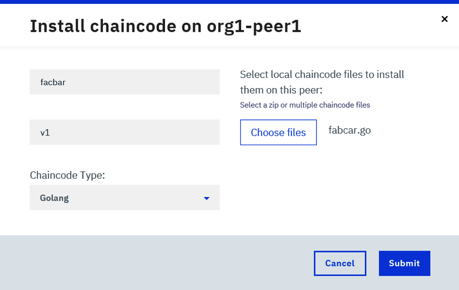

Example install of the node version of the fabcar chaincode:

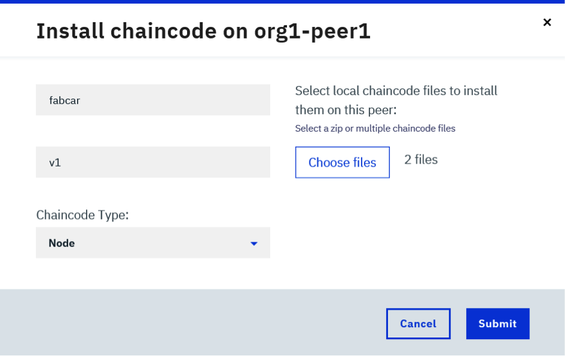

Once you have made your choice, click the `Submit` button to upload the chaincode to Starter Plan. 
Next you need to instantiate the chaincode. Click on the `three dots` in the `Actions` column to see the menu and choose `Instantiate`.

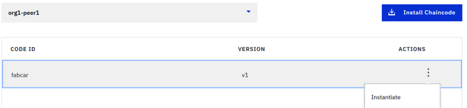

On the `Instantiate chaincode` dialog, there are no arguments to provide for fabcar as it does not need any. However, you do need to select `defaultchannel` from the `Channel` drop-down and match the `Chaincode Type` to the language (**Node** or **Golang**) of the code you uploaded above. Then click `Submit`.

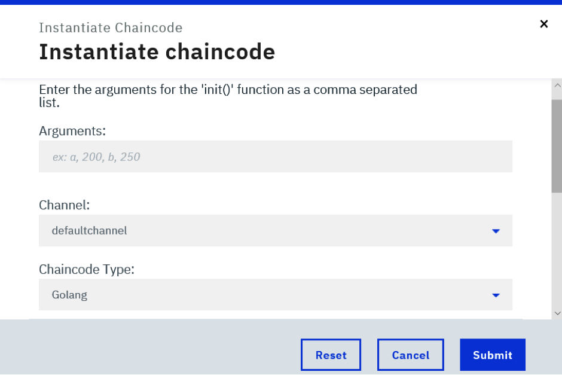

Once this completes, you can select the `fabcar` row to see that the chaincode is now instantiated on the defaultchannel:

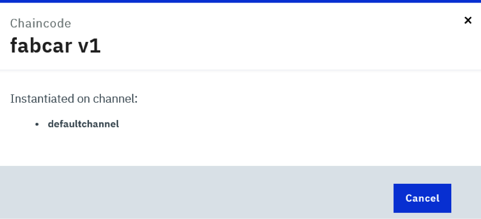

Now the chaincode has been instantiated on the channel, select the Channels side tab and select the `defaultchannel` row to see its details:

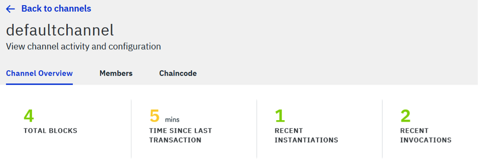

You can now see there is one extra block on the channel which is the record of the instantiate operation we performed above. Now select the `Chaincode` tab on this screen and select the `fabcar` row to expand it. You can now see two buttons under fabcar:

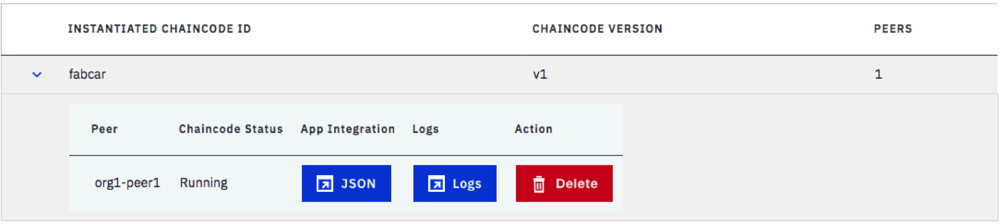

**JSON**: This JSON file holds the credentials and peer information for the blockchain network.

**Delete**: This stops and deletes the chaincode instance.

Next, in the `fabric-samples/fabcar` folder that was downloaded from github, create a new folder called **config**. Click the **JSON** button shown above, and a new tab will open. Copy all the data shown in this tab into a new file called `network-profile.json` and save this file inside the `fabric-samples/fabcar/config` folder you just created.


### 5. Configure your application to run on the IBM Blockchain Platform

The fabcar applications you downloaded from github are hard-coded to use a local instance of Fabric. Because we are using Fabric located remotely on IBM Blockchain Platform, this article comes with new versions of the fabcar apps that will connect securely to the remote platform using the `network-profile.json` configuration file you just download and saved above. The original four fabcar applications are called:

- enrollAdmin.js

- registerUser.js

- invoke.js

- query.js

The zip file that comes with this article contains new versions of these files called:

- enrollAdminNetwork.js
- registerUserNetwork.js
- invokeNetwork.js
- queryNetwork.js

These new files all end with the word `Network` to indicate these are the new versions that will access fabcar remotely and to ensure they will not replace the original files. The zip also contains one extra configuration file called:

- client-profile.json

The `client-profile.json` file contains some extra configuration needed to access the remote fabcar chaincode.

Your next step is to extract these files from the zip file and put them into the correct locations. The first four files ending in `Network` should be placed into the `fabric-samples/fabcar` folder alongside the original four files from githhub. The `client-profile.json` file should be placed into the `fabric-samples/fabcar/config` folder alongside the `network-profile.json` file you downloaded and saved earlier.

**Run npm install**

The fabcar client application is written in Node.js. In order to complete this next step, you will need to have `Node.js` and `npm` installed on your local machine. *Note that currently Node.js v7 is not supported and you need to use v6.9.0 or earlier.*  Return to the command-line or terminal window and run the npm install command from within the fabcar folder:

`cd fabric-samples/fabcar`

`npm install`

On Windows, you may need to install the Windows Build Tools if you get build errors:

`npm install --global windows-build-tools`

All the prerequisite node packages are now installed in order to run the fabcar client application.

**Enrolling an Admin**

When your network was created in Starter Plan, each organisation had an Administrator user called `admin` automatically registered with the Certificate Authority (CA). You now need to send an enrolment request to the CA to retrieve their enrolment certificate (eCert). From within the fabcar folder run:

`node enrollAdminNetwork.js`

You should see output like this:

```
> node enrollAdminNetwork.js
Found organization: org1 and ca name: org1-ca
Enrolling using enrollmentId: admin and EnrollmentSecret: 2d87ae1b59
Successfully enrolled admin user "admin" with msp: "org1

```

The `enrollAdminNetwork.js` application will create a local public/private key pair in a folder it creates called `hfc-key-store` and send a Certificate Signing Request (CSR) to the remote CA for org1 to issue the eCert. The eCert, along with some metadata, will also be stored in the `hfc-key-store` folder. The connection details of where the CA is located and the TLS certificate needed to connect to it are all obtained by the application from the `network-profile.json` you downloaded earlier.


**Enrolling a new user**

Using the eCert for the admin user we will now register and enrol a new user called ‘user1’ with the CA. This user will be the one whose identity we will use to update and query the ledger. From within the fabcar folder run:

`node registerUserNetwork.js`

You should see output like this:

```
> node registerUserNetwork.js
Successfully loaded admin from persistence
Successfully registered "user1" - with secret:gTYshgoNxoLH
Successfully enrolled member user "user30" with msp: "org1"
"user1" was successfully registered and enrolled and is ready to interact with the fabric network

```

Like the previous command this application has created a new public/private key pair and sent a CSR request to the CA to issue the eCert for user1. If you look in the `hlf-key-store` folder you should see six files, three for each identity.


**Initialize the ledger**

The original fabcar sample from github has a script that automatically calls an `initledger` transaction to populate the ledger with 10 initial vehicles to get you started quickly. Because we are not using this script, we need to call this transaction ourselves. The `invokeNetwork.js` command has been written to call this directly so we can just run this command next:


`node invokeNetwork.js`

You should see output that ends like this:

```
...

Successfully committed the change to the ledger by the peer

```

As the chaincode gets run in a separate chaincode docker container, it can take sometime to start this container on first use. If you get a timeout or a `premature execution` error, just try running the command again. If you take a look at the `Channel Overview` after the command has completed successfully, you should see there is now an extra block on the ledger:

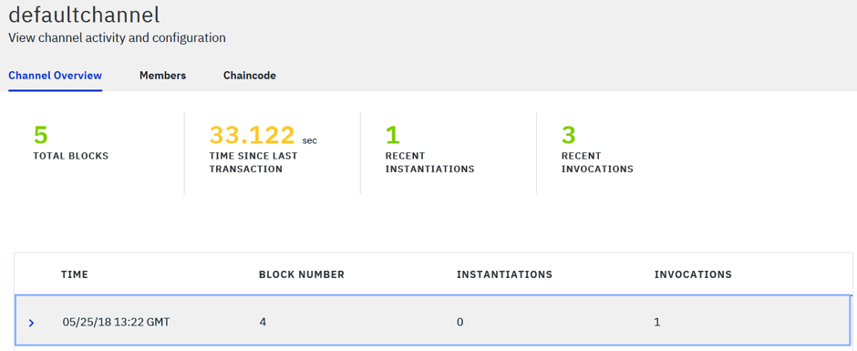

**Query the ledger**

The `invokeNetwork.js` command has now populated the ledger with sample data for 10 cars, so let's query the ledger to see the data. To do this we are going to run the queryNetwork.js command which is set up to query all cars that exist on the ledger:

`node queryNetwork.js`

You should see output like this:

```
> node queryNetwork.js
Successfully loaded user1 from persistence
Query has completed, checking results
Response is  [{"Key":"CAR0", "Record":{"colour":"blue","make":"Toyota","model":"Prius","owner":"Tomoko"}},{"Key":"CAR1", "Record":{"colour":"red","make":"Ford","model":"Mustang","owner":"Brad"}},{"Key":"CAR2", "Record":{"colour":"green","make":"Hyundai","model":"Tucson","owner":"Jin Soo"}},{"Key":"CAR3", "Record":{"colour":"yellow","make":"Volkswagen","model":"Passat","owner":"Max"}},{"Key":"CAR4", "Record":{"colour":"black","make":"Tesla","model":"S","owner":"Adriana"}},{"Key":"CAR5", "Record":{"colour":"purple","make":"Peugeot","model":"205","owner":"Michel"}},{"Key":"CAR6", "Record":{"colour":"white","make":"Chery","model":"S22L","owner":"Aarav"}},{"Key":"CAR7", "Record":{"colour":"violet","make":"Fiat","model":"Punto","owner":"Pari"}},{"Key":"CAR8", "Record":{"colour":"indigo","make":"Tata","model":"Nano","owner":"Valeria"}},{"Key":"CAR9", "Record":{"colour":"brown","make":"Holden","model":"Barina","owner":"Shotaro"}}]

```


**Update the ledger**
Finally, let's make an update to the ledger. To do this, you need to make a simple change to the `invokeNetwork.js` command.

Open the `invokeNetwork.js` file in an editor of your choice such as atom or VSCode, then find and edit the request variable as shown below so that it will invoke the `createCar` chaincode with a set of arguments that describe the car to be created. The changed request variable should look like this: 

```
var request = {
  chaincodeId: 'fabcar',
  fcn: 'createCar',
  args: ['CAR10', 'Honda', 'Accord', 'Black', 'Dave'],
  txId: tx_id
};

```

Save the file and run the edited command again using node `invokeNetwork.js`. The expected output is: 

```
…
Successfully committed the change to the ledger by the peer.
```

This has created a new Honda vehicle with the owner `Dave` and stored it on the ledger. You can see the new car on the ledger by running the `queryNetwork.js` command again as you did before. You can now experiment with creating new cars on the ledger with different names and owners. If you look at the `Channel Overview` you should see new blocks added as you create new cars.

Finally, you may want to experiment with the changeOwner transaction to change the owner of a vehicle. To do this, change the request variable in invokeNetwork.js again to look like this: 

var request = {
  chaincodeId: 'fabcar',
  fcn: 'changeCarOwner',
  args: ['CAR10', 'MGK'],
  txId: tx_id
};


Now save the file and run the command again using node `invokeNetwork.js`. The expected output is: 

```
…
Successfully committed the change to the ledger by the peer
```

You can see the updated owner on the ledger by running the `queryNetwork.js` command again. You can see the owner of **CAR10** has changed from **Dave** to **MGK**.

If you want to query for a single car rather than for all cars, make this change to the request variable in the `queryNetwork.js` command and rerun it: 

const request = {
  chaincodeId: 'fabcar',
  fcn: 'queryCar',
  args: ['CAR10']
};


You should now see the information for a single car:

```
> node queryNetwork.js
Successfully loaded user1 from persistence
Query has completed, checking results
Response is {"colour":"Black","make":"Honda","model":"Accord","owner":"MGK"}
```

### 6. Summary
You now have a running network on the IBM Blockchain Platform Starter Plan, with a sample chaincode deployed to a peer and instantiated on a channel. You also have a running application that you can easily work with locally. You've populated the ledger with sample data, and your application can now communicate (query and update) with the blockchain on the IBM Blockchain Platform. Happy blockchaining!

### 7. Acknowledgments
The authors thank Anthony O'Dowd of the IBM Blockchain Labs Global Engagement team for their expert guidance and support throughout the development of this tutorial.

## Additional Documentation

* [Solidity contract with Truffle](./docs/truffle-commands.md)
* [Using remix to get ABI and bytecode](./docs/using-remix.md)
* [Setup Fab Proxy and using Web3](./docs/proxy-web3-commands.md)
* [Loyalty Program Use Case](./docs/use-case.md)

## Links
* [Blockchain Basics](https://developer.ibm.com/tutorials/cl-blockchain-basics-intro-bluemix-trs/)
* [Hyperledger Fabric Docs](http://hyperledger-fabric.readthedocs.io/en/latest/)
* [Solidity](https://solidity.readthedocs.io/en/v0.4.25/index.html)


## License
[Apache 2.0](LICENSE)